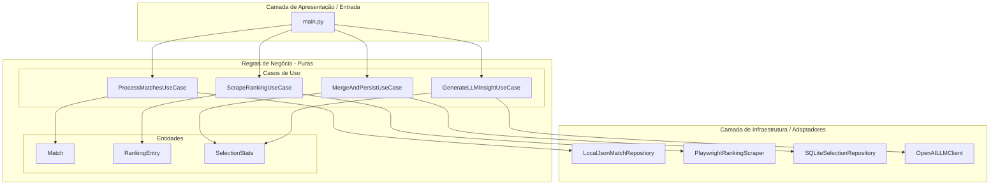
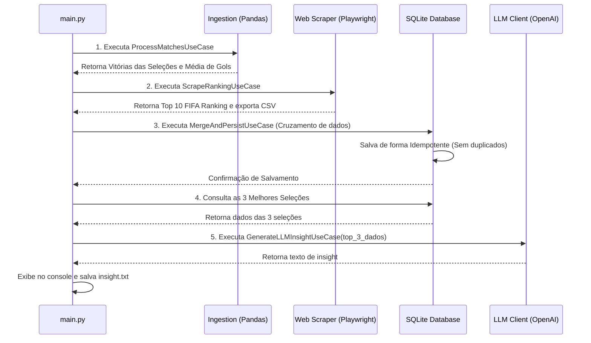

# Software Design Document (SDD)
## Projeto: World Cup Intelligence Hub

Este documento descreve a arquitetura, o design de componentes, os fluxos de dados e as definições técnicas para o desenvolvimento do **World Cup Intelligence Hub** para o desafio técnico da FPFtech.

---

## 1. Arquitetura Geral do Sistema

O sistema será construído seguindo os princípios de **Clean Architecture** (Arquitetura Limpa) e **SOLID**. O objetivo principal é isolar a lógica de negócios das dependências de infraestrutura (banco de dados, frameworks de automação web, APIs externas e LLMs).



### Divisão de Camadas:
1. **Core (Entities & Use Cases):** Contém a lógica de negócio pura do futebol e das estatísticas. Não sabe se os dados vêm de um JSON local, de um banco SQL ou de uma página web.
2. **Adapters (Gateways / Repositories):** Implementações concretas de acesso a dados e serviços externos (Playwright, SQLite, OpenAI, File Reader).
3. **Config & Entrypoint (`main.py`):** Configurações globais (logs, variáveis de ambiente) e orquestração do pipeline de automação.

---

## 2. Detalhamento dos Componentes (As 4 Tarefas)

### 📊 Módulo 1: Consumo e Processamento de Dados (Tarefa 1)
Responsável por obter os dados históricos das partidas da Copa do Mundo e realizar o processamento analítico usando Pandas.

*   **Entidades:** `Match` (representa uma partida com placar e status. Atributos: `id`, `time_da_casa`, `time_visitante`, `placar_time_da_casa`, `placar_time_visitante`, `status`).
*   **Contrato (Interface):** `MatchRepository` (método `get_all_matches()`).
*   **Implementações Concretas:**
    *   `HttpMatchRepository`: Consome dados da API pública real utilizando requisições HTTP.
    *   `LocalJsonMatchRepository`: Lê os dados de um arquivo JSON estático de mock (`data/partidas_simuladas.json`).
    *   `ResilientMatchRepository` (Padrão Proxy/Resiliência): Tenta obter os dados através do `HttpMatchRepository`. Caso ocorra alguma falha (erro de conexão, timeout ou chave inválida), realiza automaticamente o fallback para o `LocalJsonMatchRepository`.
*   **Caso de Uso:** `ProcessMatchesUseCase`
    *   **Entrada:** Dados brutos de partidas através do repositório resiliente.
    *   **Processamento (Pandas):**
        1. Limpar dados: Filtrar partidas com `status == 'FINALIZADA'` e sem valores nulos em placares.
        2. Média de gols: Somar `placar_time_da_casa + placar_time_visitante` e aplicar a média.
        3. Vitórias: Computar o vencedor de cada partida (comparando `placar_time_da_casa` e `placar_time_visitante`) e agregar as 5 seleções com mais vitórias.
    *   **Saída:** Lista de seleções e quantidade de vitórias, além do valor da média de gols.

### 🌐 Módulo 2: Automação Web / Scraping (Tarefa 2)
Responsável por acessar o ranking mundial da FIFA (ou Wikipedia/outro site esportivo confiável) e extrair o Top 10 atual das seleções.

*   **Entidades:** `RankingEntry` (Atributos: `ranqueamento`, `nome_selecao`, `pontos`).
*   **Contrato (Interface):** `RankingScraper` (método `fetch_top_10()`).
*   **Implementação Concreta:** `PlaywrightRankingScraper` (usa o Playwright para automatizar o navegador em modo *headless*, navegar até a página e ler os dados).
*   **Caso de Uso:** `ScrapeRankingUseCase`
    *   **Entrada:** Nenhuma (usa a URL configurada como `URL_RANKING_FIFA` no `config.json`).
    *   **Processamento:** Inicializa o navegador, aguarda os seletores CSS da tabela de ranking, extrai o Top 10 e gera um arquivo CSV.
    *   **Saída:** Lista de `RankingEntry` e o arquivo CSV gerado.

### 💾 Módulo 3: Persistência, Logs e Cruzamento de Dados (Tarefa 3)
Responsável por cruzar as estatísticas do Pandas (Tarefa 1) com o ranking extraído da Web (Tarefa 2), persistir os dados consolidados e registrar o histórico de logs de execução do pipeline em tabelas relacionais do banco de dados **PostgreSQL** rodando via Docker, garantindo a idempotência.

*   **Entidades:**
    *   `SelectionStats` (Atributos: `nome_selecao`, `vitorias`, `pontos`).
    *   `PipelineLog` (Atributos: `id_execucao`, `passo`, `nivel`, `mensagem`, `id`, `timestamp`).
*   **Contratos (Interfaces):**
    *   `SelectionStatsRepository` (métodos `save(stats)` e `get_top_3()`).
    *   `PipelineLogRepository` (método `write_log(log_entry)`).
*   **Implementações Concretas:**
    *   `PostgreSqlSelectionRepository` (conecta ao banco PostgreSQL, gerencia tabelas e garante a inserção idempotente).
    *   `PostgreSqlPipelineLogRepository` (escreve as etapas do pipeline diretamente no banco PostgreSQL para auditoria histórica).
*   **Casos de Uso:**
    *   `MergeAndPersistUseCase`:
        *   **Entrada:** Top de Vitórias (Tarefa 1) e Top de Ranking (Tarefa 2).
        *   **Processamento:**
            1. Faz o cruzamento (merge) dos dados pelo nome da seleção (`nome_selecao`).
            2. Insere os dados de forma **idempotente** (utilizando restrição de chave única `UNIQUE(nome_selecao)` e cláusula `INSERT INTO ... ON CONFLICT(nome_selecao) DO UPDATE SET ...` do PostgreSQL).
        *   **Saída:** Confirmação da gravação e logs persistidos no banco.

### 🤖 Módulo 4: Integração com LLM para Insights (Tarefa 4)
Responsável por enviar os dados consolidados das 3 melhores seleções para a API de IA e obter uma justificativa estatística de quem vencerá a próxima Copa. O design permite plugar qualquer LLM que suporte o protocolo padrão de mercado.

*   **Contrato (Interface):** `LLMClient` (método `generate_insight(selections_data)`).
*   **Implementação Concreta:** 
    *   `OpenAICompatibleLLMClient`: Implementação genérica que utiliza a biblioteca oficial `openai` do Python, mas aceita uma `base_url` parametrizável. Isso permite conectar nativamente a **qualquer provedor de IA compatível com a API da OpenAI** (OpenAI GPT, DeepSeek API, Anthropic via gateway/proxy, Ollama para execução local offline, Groq, OpenRouter, etc.).
    *   `MockLLMClient`: Caso nenhuma chave seja fornecida ou a integração esteja desabilitada, simula uma resposta analítica bem-estruturada baseada em templates locais, evitando falhas de execução.
*   **Caso de Uso:** `GenerateLLMInsightUseCase`
    *   **Entrada:** Dados consolidados das 3 melhores seleções obtidas do banco.
    *   **Processamento:** Formata o prompt estruturado e consome o cliente LLM configurado.
    *   **Saída:** Texto explicativo gerado salvo em arquivo de texto e exibido no console.

---

## 3. Estrutura de Pastas (Scaffold)

O projeto será estruturado de forma modular e altamente desacoplada:

```text
world-cup-hub/
├── docs/
│   └── system_design.md        # Documentação arquitetural
│
├── core/                       # Lógica de Negócios Pura (Entities & Use Cases)
│   ├── __init__.py
│   ├── entities/               # Modelos de dados limpos
│   │   ├── __init__.py
│   │   ├── match.py
│   │   ├── ranking.py
│   │   └── stats.py
│   │
│   └── use_cases/              # Regras de orquestração analítica
│       ├── __init__.py
│       ├── process_matches.py
│       ├── scrape_ranking.py
│       ├── merge_persist.py
│       └── generate_insight.py
│
├── adapters/                   # Adaptadores de Entrada/Saída (I/O)
│   ├── __init__.py
│   ├── api/                    # Repositórios de dados de partidas (Tarefa 1)
│   │   ├── __init__.py
│   │   ├── interfaces.py       # Classe abstrata MatchRepository
│   │   ├── local_json.py       # Implementação leitura local
│   │   ├── http_client.py      # Implementação requisição HTTP
│   │   └── resilient.py        # Implementação proxy/fallback
│   │
│   ├── scraper/                # Automação Web (Tarefa 2)
│   │   ├── __init__.py
│   │   ├── interfaces.py       # Classe abstrata RankingScraper
│   │   └── playwright_impl.py  # Implementação Playwright
│   │
│   ├── database/               # Persistência SQL (Tarefa 3)
│   │   ├── __init__.py
│   │   ├── interfaces.py       # Classe abstrata SelectionStatsRepository
│   │   └── postgres_impl.py    # Implementação PostgreSQL
│   │
│   └── llm/                    # Clientes de IA (Tarefa 4)
│       ├── __init__.py
│       ├── interfaces.py       # Classe abstrata LLMClient
│       ├── openai_impl.py      # Implementação OpenAI
│       └── mock_impl.py        # Implementação Mock/Fallback
│
├── config/                     # Configurações globais do sistema
│   ├── __init__.py
│   ├── settings.py             # Parser central de variáveis (.env e config.json)
│   └── logging_config.py       # Setup centralizado de logs
│
├── data/                       # Arquivos e recursos locais
│   └── matches_mock.json       # JSON estático de partidas para fallback
│
├── config.json                 # Arquivo de configuração de caminhos, URLs e seletores (não sensível)
├── .env                        # Credenciais e tokens de acesso (sensível, ignorado no git)
├── .env.example                # Template de configuração
├── requirements.txt            # Dependências python
├── Dockerfile                  # Especificação do container da aplicação
├── docker-compose.yml          # Definição de serviços Docker
└── main.py                     # Script principal de execução
```

---

## 4. Fluxo de Dados do Pipeline

A execução do pipeline principal no `main.py` seguirá a seguinte sequência lógica linear:



---

## 5. Gestão de Credenciais e Configuração

Para seguir as melhores práticas de segurança e portabilidade, dividimos as configurações em dois arquivos:

### A. Arquivo `config.json` (Não Sensível)
Configurações estruturais do pipeline que podem ser comitadas no repositório Git. Evita *hardcoding* no código.
*   `URL_RANKING_FIFA`: URL usada para o web scraping do ranking.
*   `ARQUIVO_PARTIDAS_MOCK`: Caminho local para o arquivo de backup de partidas (JSON).
*   `CAMINHO_EXPORT_CSV`: Caminho onde o CSV extraído do ranking deve ser salvo.
*   `CAMINHO_EXPORT_INSIGHTS`: Caminho do arquivo `.txt` que conterá os insights gerados pela IA.
*   `TEMPO_DE_ESPERA`: Tempo limite (ms) para espera de elementos na automação.

### B. Arquivo `.env` (Sensível / Especificações de Ambiente)
Dados sensíveis, credenciais e chaves privadas que **nunca** devem ir para o controle de versão (adicionados ao `.gitignore`).
*   `DB_HOST`: Host de conexão do banco de dados (ex: `localhost` em desenvolvimento local, ou `db` quando executado via Docker Compose).
*   `DB_PORT`: Porta de conexão (default: `5432`).
*   `DB_NAME`: Nome do banco de dados PostgreSQL.
*   `DB_USER`: Usuário de acesso ao banco.
*   `DB_PASSWORD`: Senha do usuário do banco.
*   `LLM_API_KEY`: Chave de autenticação com o provedor de IA (ex: chave OpenAI ou DeepSeek). Se deixado em branco, o sistema aciona o `MockLLMClient` automaticamente.
*   `LLM_API_BASE_URL`: URL base da API da LLM (default: `https://api.openai.com/v1`). Pode ser alterada para `http://localhost:11434/v1` para rodar com Ollama localmente ou para a URL do DeepSeek, Groq, etc.
*   `LLM_MODEL`: ID do modelo de LLM selecionado para gerar insights (ex: `gpt-4o-mini`, `deepseek-chat`, `llama3`).
*   `ENVIRONMENT`: Identificação do ambiente de execução (`development`, `production`).

### C. Logs Híbridos (Arquivo & Banco de Dados)
Para máxima auditabilidade e seguindo padrões de engenharia maduros, o sistema implementará uma estratégia de logs em duas frentes:
1.  **Logs de Aplicação (Arquivo/Console):** Utiliza o módulo padrão `logging` do Python salvando detalhes de depuração técnica em `data/app.log` e exibindo-os no terminal em tempo real.
2.  **Histórico de Execução (Banco de Dados):** O pipeline registrará cada marco importante na tabela `pipeline_run_logs` (ex: Início de execução, Sucesso da raspagem de dados, Falha da API real e acionamento de fallback, etc.). Cada execução terá um identificador único (`id_execucao` gerado via UUID) permitindo rastrear o histórico completo e a telemetria do sistema ao longo do tempo.

---

## 6. Comandos e Automação (Makefile)

Para facilitar a execução local, a instalação de dependências e a orquestração do ambiente Docker, o projeto disponibilizará um `Makefile` na raiz. Os principais comandos suportados são:

*   `make setup`: Instala os requisitos de `requirements.txt` e inicializa os binários do Playwright.
*   `make run`: Executa o pipeline de automação localmente (`python main.py`).
*   `make test`: Executa os testes automatizados do sistema.
*   `make compose-up`: Sobe os contêineres do Docker em background (App + PostgreSQL).
*   `make compose-down`: Para e desliga todos os contêineres Docker.
*   `make compose-build`: Reconstrói a imagem Docker da aplicação.
*   `make clean`: Limpa arquivos temporários do Python e caches de teste.

